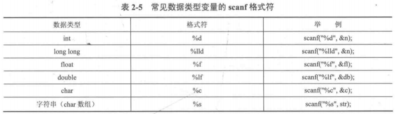
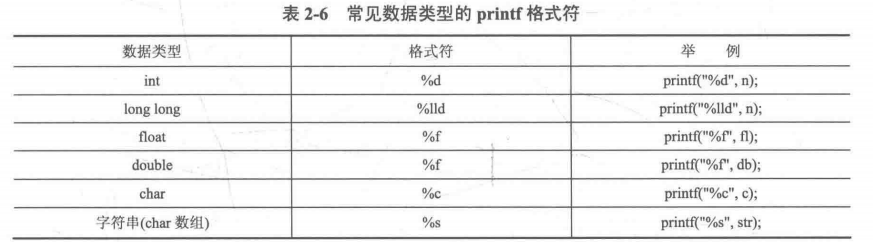

# NOTE

## 第二章 C/C++快速入门

​	注意:有些读者认为学过C++之后就没有必要学C 语言，甚至觉得C语言太麻烦而不学，这是不太正确的。因为就机考使用的语法而言，除了输入和输出部分，其余顺序结构、分支结构、循环结构、数组、指针都是几乎一样的，学习C语言并不会带来什么负担。对于让C+ 使用者觉得麻烦的scanf函数和printf函数，虽然必须承认cin和cout 可以不指定输入输出格式比较方便，但是cin和cout 消耗的时间比scanf 和printf 多得多，很多题目可能输入还没结束就超时了。

### 2.1 基本数据类型

#### 2.1.1 变量的定义

不能是C语言标识符；第一个字符是字母或者下划线；区分大小写

##$$# 2.1.2 变量类型


如果longlong 型赋大于$2^{31}-1$的初值，则需要在初值后面加上**L**，否则会编译错误。

整型数据前加**unsigned**，无符号，把负数范围挪到整数，取值范围再乘2倍

通过“char c”的方式定义一个字符，那么c被称为“字符变量”，可以被赋值。但对于字符本身，如“c”，无法被改变、赋值，是“字符常量”。C语言中，字符常量统一用ASCII码统一编码。字符常量（必须是单个字符）必须用单引号标注。

`char c = 117;`此处c变量的输出为u，实际上是把ASCII码赋值给了c，而'u'的ASCII码为117。

转义字符/控制字符：不可显示。`\n`表示换行；`\0`表示空字符NULL，注意不是空格。

字符串常量：由双引号标记的字符集，如“nihaoya”。C语言中用字符数组存储。

布尔型中，true=非零，包括正整数和负整数。

#$$## 2.1.3 强制类型转换

`(新类型名)变量名` 浮点数强制转化为整型，直接保留整数部分。

#### 2.1.4 符号常量和const常量

符号常量又称宏定义或者宏替换。`#define 标识符 常量` 或者 `const 数据类型 变量名 = 常量`。同时可以，`#define 标识符 任何语句或片段`，如`#define ADD(a, b) ((a) + (b))`

注意“多加括号”，因为宏定义是直接将对应的部分替换。如以下代码：

```c
#include <stdio.h>
#define CAL(x) (x * 2 + 1)
int main(){
	int a = 1;
	print("%d\n", CAL(a + 1));
	return 0;
}
```

这里会输出4，因为`CAL(a + 1)`实际上是`(a + 1*2 + 1)`，而非`((a+1)*2 + 1)`。

#### 2.1.5 运算符

三目运算符：`A ? B : C`，若A成立，则返回B，否则返回C。

位运算：`<< >> $ \ ^ ~`。其中，`~`为位取反，即0变1，1变0。

### 2.2 顺序结构

#### 2.2.1 赋值表达式

#### 2.2.2 使用scanf和printf输入/输出

##### 1. scanf函数的使用

`scanf(“格式控制”, 变量地址);`如，`scanf("%d", &n);`。

**&的解释：**在C语言中，变量在定义之后，会在计算机内存中分配一块空间给这个变量，该空间在内存中的地质称为变量的地址。为了得到变量地质，需要在变量前加一个`&`（称为**取地址运算符**）。



其中，数组比较特殊，数组名称本身就代表了数组第一个元素的地址，所以不需要再取地址。

若要实现`hh:mm:ss`这类时间输入，可以这样`scanf("%d:%d:%d", &hh, &mm, &ss);`

若要实现`3 4`这类带空格的输入，`%d`之间可以不加空格。因为除了`%c`，`scanf`对其他格式符的输入是以空白符为结束判断标志的。另外，字符数组使用`%s`读入时，以空格跟换行为读入结束的标志。

```c
int a;
char b, c[10];
scanf("%d%c%s", &a, &b, c);
printf("%d-%c-%s\n", a, b, c);
```

输入`15 a bcd`，输出`15- -a`。

##### 2. printf函数的使用

`scanf(“格式控制”, 变量名称);`



想输出%或者\，需要DOUBLE。如`printf("%%");``printf("\\");`

**%md：**使不足m位的`int`型变量以m位进行右对齐输出，其中高位用空格补齐，若本身超过m位，则保持原样。

**%0md：**与`%md`不同的是，当变量不足m位时，将在前面补足够数量的0而不是空格。

**%.mf：**可以让浮点数保留m位小数输出，这个“保留”使用**四舍六入五成双**规则。【当需要修约的数字正好是5时，需要根据5前面的数字（即"5的邻居"）来决定是舍去还是进位。如果5前面的数字是偶数，则舍去5；如果5前面的数字是奇数，则进位。这种修约方法在统计学和数据分析中很有用，因为它减少了修约过程中的累积误差，尤其是当对一组数据进行多次修约操作时】

#### 2.2.3 使用getchar和putchar输入/输出字符

`getchar`用来输入单个字符且可以识别并存储换行符，`putchar`用来输出单个字符。

```c
char c1, c2, c3;
c1 = getchar();
getchar();
c2 = getchar();
putchar(c1);
putchar(c2);
putchar(c3);
# input：abcd
# output：acd
```

#### 2.2.4 注释

`/* */` `// `

#### 2.2.5 typedef

给复杂的数据类型起别名：`typedef long long LL;`

#### 2.2.6 常用math函数

`fabs(double x)`：给double型变量取绝对值

`floor(double x)和ceil(double x)`：向下和向上取整

`pow(double r, double p)`：返回$r^p$

`sqrt(double x)`：算数平方根

`log(double x) / sin(double x) / cos(double x) / tan(double x) / round(double x)`

### 2.3 选择结构

### 2.4 循环结构

### 2.5 数组

### 2.6 函数

### 2.7 指针

### 2.8 结构体

### 2.9 补充

### 2.10 黑盒测试

## 第三章 入门篇（1）——入门模拟

## 第四章 入门篇（2）——算法初步

### 4.1 排序

#### 4.1.1 选择排序

```c++
for(int i = 1;i <= n; i++){
	int k = i;
	for(int j = i; j <= n; j++){
		if(A[j] < A[i])
			k = j;
	}
	int tmp = A[i];
	A[i] = A[k];
	a[k] = tmp;
}
```

#### 4.1.2插入排序

```c++
for(int i = 2; i <= n; i++){
	int tmp = A[i], j = i;
	while(j >  1 && tmp < A[j - 1]){
		A[j] = A[j - 1];
		j--;
	}
	A[j] = tmp;
}
```

#### 4.1.3 排序题与sort函数的应用

1. 结构体定义

   ```c++
   struct Student{
   	char name[10];
   	int id;
   }stu[1001];
   ```

2. cmp函数编写

   ```c++
   bool cmp(Student a, Student B){
   	if(a.score != b.score)	return a.score > b.score;
   	else	return strcmp(a.name, b.name) < 0;
   }
   ```

   `strcmp`用来比较两个char型数组的字典序大小，前者小于后者则返回负数，否则返回正数。

### 4.2 散列

#### 4.2.1 散列的定义与整数散列

题目：给出N个正整数和M个正整数，问M个整数中的元素是否在N个正整数中出现。

用**空间换时间**：若N个正整数中有数字a，则`hashTable[a] = True`，即将输入的数作为数组的下标来进行统计。

**散列（hash）**：将元素通过一个函数转换为整数，使得整数尽量唯一地代表这个元素。这个转换函数称为**散列函数 $H$**。

对于key是整数的情况下，有直接定址法、平方取中法、除留余数法。

直接定址法：恒等变换（$H(key) = key$）或线性变换（$H(key)=a*key+b$）

平方取中法：取key的平方的中间若干位作为hash值

除留余数法：$H(key) = key\ \% \ mod$。当$mod$是素数时，$H$能尽可能覆盖$[0, mod)$范围内的每个数

除留余数法中，可能会有2个不同的数，但是会有相同的HASH值，以下是三种解决冲突的方法：

1. 线性探查法（Linear Probing）

   暴力循环下一个位置，看是否空

2. 平方探查法（Quadratic Probing）

   找$H(key)^2 + k^2$/$H(key)^2 - k^2$，其中$k \in [0, Tsize)$。若变成负数，则取$((H(key)-k^2) \% Tsize + Tsize)\%Tsize$

3. 链地址法（拉链法）

   将所有$H(key)$相同的key连接成一条单链表。`Link[h]`存放`H(key)=h`的一条单链表

#### 4.2.2 字符串hash初步


## 第五章 入门篇（3）——数学问题

## 第六章 STL

## 第七章 提高篇（1）——数据结构专题（1）

## 第八章 提高篇（2）——搜索专题

## 第九篇 提高篇（3）——数据结构专题（2）

## 第十章 提高篇（4）——图算法专题

## 第十一章 提高篇（5）——动态规划专题

## 第十二章 提高篇（6）——字符串专题

## 第十三章 专题扩展