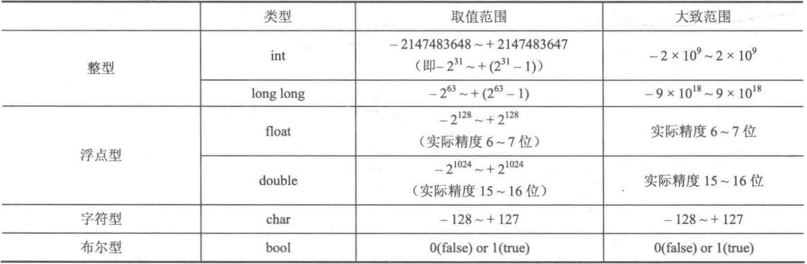

# NOTE

[TOC]

## 第二章 C/C++快速入门

​	注意:有些读者认为学过C++之后就没有必要学C 语言，甚至觉得C语言太麻烦而不学，这是不太正确的。因为就机考使用的语法而言，除了输入和输出部分，其余顺序结构、分支结构、循环结构、数组、指针都是几乎一样的，学习C语言并不会带来什么负担。对于让C+ 使用者觉得麻烦的scanf函数和printf函数，虽然必须承认cin和cout 可以不指定输入输出格式比较方便，但是cin和cout 消耗的时间比scanf 和printf 多得多，很多题目可能输入还没结束就超时了。

### 2.1 基本数据类型

#### 2.1.1 变量的定义

不能是C语言标识符；第一个字符是字母或者下划线；区分大小写

### 2.1.2 变量类型



如果longlong 型赋大于 $2^{31}-1$ 的初值，则需要在初值后面加上 **L** ，否则会编译错误。

整型数据前加**unsigned**，无符号，把负数范围挪到整数，取值范围再乘2倍

通过“char c”的方式定义一个字符，那么c被称为“字符变量”，可以被赋值。但对于字符本身，如“c”，无法被改变、赋值，是“字符常量”。C语言中，字符常量统一用ASCII码统一编码。字符常量（必须是单个字符）必须用单引号标注。

`char c = 117;`此处c变量的输出为u，实际上是把ASCII码赋值给了c，而'u'的ASCII码为117。

转义字符/控制字符：不可显示。`\n`表示换行；`\0`表示空字符NULL，注意不是空格。

字符串常量：由双引号标记的字符集，如“nihaoya”。C语言中用字符数组存储。

布尔型中，true=非零，包括正整数和负整数。

### 2.1.3 强制类型转换

`(新类型名)变量名` 浮点数强制转化为整型，直接保留整数部分。

#### 2.1.4 符号常量和const常量

符号常量又称宏定义或者宏替换。`#define 标识符 常量` 或者 `const 数据类型 变量名 = 常量`。同时可以，`#define 标识符 任何语句或片段`，如`#define ADD(a, b) ((a) + (b))`

注意“多加括号”，因为宏定义是直接将对应的部分替换。如以下代码：

```c
#include <stdio.h>
#define CAL(x) (x * 2 + 1)
int main(){
	int a = 1;
	print("%d\n", CAL(a + 1));
	return 0;
}
```

这里会输出4，因为`CAL(a + 1)`实际上是`(a + 1*2 + 1)`，而非`((a+1)*2 + 1)`。

#### 2.1.5 运算符

三目运算符：`A ? B : C`，若A成立，则返回B，否则返回C。

位运算：`<< >> $ \ ^ ~`。其中，`~`为位取反，即0变1，1变0。

### 2.2 顺序结构

#### 2.2.1 赋值表达式

#### 2.2.2 使用scanf和printf输入/输出

##### 1. scanf函数的使用

`scanf(“格式控制”, 变量地址);`如，`scanf("%d", &n);`。

**&的解释：**在C语言中，变量在定义之后，会在计算机内存中分配一块空间给这个变量，该空间在内存中的地质称为变量的地址。为了得到变量地质，需要在变量前加一个`&`（称为**取地址运算符**）。


其中，数组比较特殊，数组名称本身就代表了数组第一个元素的地址，所以不需要再取地址。

若要实现`hh:mm:ss`这类时间输入，可以这样`scanf("%d:%d:%d", &hh, &mm, &ss);`

若要实现`3 4`这类带空格的输入，`%d`之间可以不加空格。因为除了`%c`，`scanf`对其他格式符的输入是以空白符为结束判断标志的。另外，字符数组使用`%s`读入时，以空格跟换行为读入结束的标志。

```c
int a;
char b, c[10];
scanf("%d%c%s", &a, &b, c);
printf("%d-%c-%s\n", a, b, c);
```

输入`15 a bcd`，输出`15- -a`。

##### 2. printf函数的使用

`scanf(“格式控制”, 变量名称);`


想输出%或者\，需要DOUBLE。如`printf("%%");``printf("\\");`

**%md：** 使不足m位的`int`型变量以m位进行右对齐输出，其中高位用空格补齐，若本身超过m位，则保持原样。

**%0md：** 与`%md`不同的是，当变量不足m位时，将在前面补足够数量的0而不是空格。

**%.mf：** 可以让浮点数保留m位小数输出，这个“保留”使用**四舍六入五成双**规则。【当需要修约的数字正好是5时，需要根据5前面的数字（即"5的邻居"）来决定是舍去还是进位。如果5前面的数字是偶数，则舍去5；如果5前面的数字是奇数，则进位。这种修约方法在统计学和数据分析中很有用，因为它减少了修约过程中的累积误差，尤其是当对一组数据进行多次修约操作时】

#### 2.2.3 使用getchar和putchar输入/输出字符

`getchar`用来输入单个字符且可以识别并存储换行符，`putchar`用来输出单个字符。

```c
char c1, c2, c3;
c1 = getchar();
getchar();
c2 = getchar();
putchar(c1);
putchar(c2);
putchar(c3);
# input：abcd
# output：acd
```

#### 2.2.4 注释

`/* */` `// `

#### 2.2.5 typedef

给复杂的数据类型起别名：`typedef long long LL;`

#### 2.2.6 常用math函数

`fabs(double x)`：给double型变量取绝对值

`floor(double x)和ceil(double x)`：向下和向上取整

`pow(double r, double p)`：返回 $r^p$

`sqrt(double x)`：算数平方根

`log(double x) / sin(double x) / cos(double x) / tan(double x) / round(double x)`

### 2.3 选择结构

### 2.4 循环结构

### 2.5 数组

### 2.6 函数

### 2.7 指针

### 2.8 结构体

### 2.9 补充

### 2.10 黑盒测试

## 第三章 入门篇（1）——入门模拟

## 第四章 入门篇（2）——算法初步

### 4.1 排序

#### 4.1.1 选择排序

```c++
for(int i = 1;i <= n; i++){
	int k = i;
	for(int j = i; j <= n; j++){
		if(A[j] < A[i])
			k = j;
	}
	int tmp = A[i];
	A[i] = A[k];
	a[k] = tmp;
}
```

#### 4.1.2插入排序

```c++
for(int i = 2; i <= n; i++){
	int tmp = A[i], j = i;
	while(j >  1 && tmp < A[j - 1]){
		A[j] = A[j - 1];
		j--;
	}
	A[j] = tmp;
}
```

#### 4.1.3 排序题与sort函数的应用

1. 结构体定义

   ```c++
   struct Student{
   	char name[10];
   	int id;
   }stu[1001];
   ```

2. cmp函数编写

   ```c++
   bool cmp(Student a, Student B){
   	if(a.score != b.score)	return a.score > b.score;
   	else	return strcmp(a.name, b.name) < 0;
   }
   ```

   `strcmp`用来比较两个char型数组的字典序大小，前者小于后者则返回负数，否则返回正数。

### 4.2 散列

#### 4.2.1 散列的定义与整数散列

题目：给出N个正整数和M个正整数，问M个整数中的元素是否在N个正整数中出现。

用**空间换时间**：若N个正整数中有数字a，则`hashTable[a] = True`，即将输入的数作为数组的下标来进行统计。

**散列（hash）**：将元素通过一个函数转换为整数，使得整数尽量唯一地代表这个元素。这个转换函数称为**散列函数 $H$**。

对于key是整数的情况下，有直接定址法、平方取中法、除留余数法。

直接定址法：恒等变换（ $H(key) = key$ ）或线性变换（ $H(key)=a*key+b$ ）

平方取中法：取key的平方的中间若干位作为hash值

除留余数法： $H(key) = key\ \% \ mod$ 。当 $mod$ 是素数时， $H$ 能尽可能覆盖 $[0, mod)$ 范围内的每个数

除留余数法中，可能会有2个不同的数，但是会有相同的HASH值，以下是三种解决冲突的方法：

1. 线性探查法（Linear Probing）

   暴力循环下一个位置，看是否空

2. 平方探查法（Quadratic Probing）

   找 $H(key)^2 + k^2$ / $H(key)^2 - k^2$ ，其中$k \in [0, Tsize)$。若变成负数，则取 $((H(key)-k^2) \% Tsize + Tsize)\%Tsize$

3. 链地址法（拉链法）

   将所有 $H(key)$ 相同的key连接成一条单链表。`Link[h]`存放`H(key)=h`的一条单链表

#### 4.2.2 字符串hash初步

将字符串映射称为一个整数，使得该整数尽可能唯一地代表字符串。

将每个字母视作0 - 25、 26 - 51，采用52进制转化位十进制。

  ### 4.3 递归

#### 4.3.1 分治（divide and conquer）

把原问题拆分为若干个规模较小而结构与原问题相同或相似的子问题，然后分别解决这些子问题，最后合并子问题的解，即课得到为原问题的解。

严格来讲：把子问题个数为1的情况称为减治（decrease and conquer），而把子问题个数大于1的情况称为分治。

#### 4.3.2 递归

递归在于反复调用自身函数，但是每次都把问题范围缩小，直到范围缩小到可以直接得到边界数据的结果，然后在返回的路上求出对应的解。

两个概念：递归边界，递归式（或称 递归调用）。

### 4.4 贪心

#### 4.4.1 简单贪心

考虑当前状态下局部最优（或较优）的策略，来使全局的结果达到最优（或较优）。证明的一般思路是使用反证法以及数学归纳法。

#### 4.4.2 区间贪心

给出N个开区间(x, y)，从中选择尽可能多的开区间，使得这些开区间两两没有交集。

### 4.5 二分

#### 4.5.1 二分查找

原理不提。注意：`mid = (left + right) / 2`可能会发生超过`int`而导致溢出，此处可以使用`mid = left + (right - left)/2`。

#### 4.5.2 二分法拓展

除了整数情况下的二分查询问题，当`right - left < 1e-5`时满足精度要求。一般用`eps`表示精度。

#### 4.5.3 快速幂

##### 1. 递归写法

$给定三个正整数a、b、m\ (a < 10^9, b<10^{18}, 1<m< {10}^9)，求\ a^b \%m$ 

1. 如果 $b$ 是奇数，那么有 $a^b=a*a^{b-1}$
2. 如果 $b$ 是偶数，那么有 $a^b=a^{b/2}*a^{b/2}$

```c++
typedef long long int ll;

LL binaryPow(LL a, LL b, LL m){
    if(!b)  return 1;
    if(b & 1)   return a * binaryPow(a, b - 1, m) % m;
    else{
        LL mul = binaryPow(a, b / 2, m);
        return mul * mul % m;
    }
}
```

细节注意：如果初始a大于等于m，那么需要在进入函数前让a对m去模。

##### 2. 迭代写法

对于$a^b$来说，b可以写成若干二次幂之和。 $a^b表示为a^{2k}……a^8a^4a^2a^1$ 中若干项的乘积。

```c++
typedef long long int LL;

LL binaryPow(LL a, LL b, LL m){
	LL ans = 1;
	while(b > 0){
		if(b & 1){
			ans = ans * a % m;
		}
		a = a * a % m;
		b >>= 1;
	}
	return ans;
}
```

### 4.6 two points

#### 4.6.1 什么是 two points

给定一个递增的正整数数列序列和一个正整数M，求序列中的两个不同位置的数a和b，使得它们的和恰好为M。

```c++
while(i < j){
	if(a[i] + a[j] == m){
		printf("%d %d\n", i, j);
		i++;
		j--;
	}else if(a[i] + a[j] < m){
		i++;
	}else{
		j--;
	}
}
```

#### 4.6.2 归并排序

2-路归并排序。2-路归并持序的原理是，将序列两分组，将序列归并为 $\lceil \frac{n}{2} \rceil$ 个组，组内单独排序；然后 将这些组再两两归并，生成 $\lceil \frac{n}{4} \rceil$ 个组，组内再单独排序；以此类推，直到只剩下一个组为止。

##### 1. 递归实现

……

##### 2. 非递归实现

```c++
void mergeSort(int A[]){
	// step 为组内元素个数，step / 2为左子区间元素个数，等号可以不取
	for(int step = 2; step / 2 <= n; step *= 2){
		// 每step个元素为一组，组内前step/2和后step/2个元素合并
		for(int i = 1; i <= n; i+= step){
			int mid = i + step / 2 - 1;
			if(mid + 1 <= n){ // 存在右子区间则合并
				merge(A, i, mid, mid+1, min(i + step - 1, n));
			}
		}
	}
}
```

#### 4.6.3 快速排序

对于序列 $A[1],A[2]……A[n]$ ，调整序列中元素的位置，使得 $A[i]$ 的左侧所有元素都不超过 $A[i]$ ，$A[i]$ 右侧的所有元素都大于 $A[i]$ 。

这里采用速度较快的tow points思想。

```c++
void Partition(int A[], int left, int right){
	int temp = A[left];
	while(left < right){
		while(left < right && A[right] > temp)	right--;
        // 反复左移，找到不符合条件的元素
		A[left] = A[right];
		while(left < right $$ A[left] <= temp)	left++;
		A[right] = A[left];
	}
	A[left] = temp;
	return left;
}

void quickSort(int A[], int left, int right){
    int(left < right){
        int pos = Partition(A, left, right);
        quickSort(A, left, pos - 1);
        quickSort(A, pos + 1, right);
    }
}
```

快速排序算法当序列中元素的排列比较随机市销率最高，但是序列元素接近有序时，会达到最坏时间复杂度 $O(n^2)$，导致原因主要是主元无法把当前区间划分为两个长度接近的子区间。结局方案是随机选择主元。

需注意，rand()函数只能产生 $[0, RANDMAX]$ 范围内的整数，为了避免 $[a,b]$ 超出范围的情况，可以采用： $round(1.0*rand() / RAND-MAX *(right-left)+left$ 

### 4.7 其他高效技巧与算法

#### 4.7.1 打表

用空间换时间，将所有可能需要用到的结果事先计算出来，这样后面需要的时候直接查表获得。

1. 在程序中一次性计算出所有需要用到的结果，之后的查询直接取这些结果。
2. 在程序B中分一次或者多次计算出所有需要用到的结果，手工把结果写在程序A的数组中，然后在程序A中就可以直接使用这些结果。
3. 一些感觉不会做的题，先用暴力程序计算小范围数据的结果，然后找规律。

#### 4.7.2 活用递推

有很多题目需要细心考虑过程中是否可能存在递推关系，如果能找到这样的递推关系，就能使时间复杂度下降不少。例如就一类涉及序列的题 目来说，假如序列的每一位所需要计算的值都可以通过该位左右两侧的结果计算得到，那么就可以考虑所谓的“ 左右两侧的结果” 是否能通过递推进行预处理来得到，这样在后面的使用中就可以不必反复求解。

#### 4.7.3 随机选择算法

从一个无序的数组中求出第K大的数。相比排序，可以使用随机选择算法，可以对任何输入达到 $O(n)$ 期望时间复杂度。

```c++
// 从A[left, right]返回第K大的数
int randSelect(int A[], int left, int right, int K){
    if(left == right)	return A[left];
    int p = randPartition(A, left, right);
    int M = p - left + 1; // 第M大
    if(k == M)	return A[p];
    if(K < M){
        return randSelect(A, left, p - 1, K); // 往左侧找
    }else{
        return randSelect(A, p + 1, right, K - M);
    }
}
```

## 第五章 入门篇（3）——数学问题

## 第六章 STL

——Standard Template Library

### 6.1 vector的常见用法详解

vector翻译为向量，理解为 “长度可自动改变的数组”，可以用来以邻接表的方式存储图。

#### 1. vector定义

`vector<typename> name;` 如果`typename`也是一个STL容器，那么需要在`>>`符号间加上空格，因为C++11之前的标准编译器会把它视为移位操作，导致编译错误。

#### 2. vector容器内元素的访问

##### （1）下标访问

直接访问 `vi[index]` 即可

##### （2）迭代器访问

迭代器（iterator）可以理解为类似指针一样的东西，定义为`vector<typename>::iterator it;`

```c++
vector<int>::iterator it = vi.begin()
for(int i = 0; i < 5; i++){
    printf("%d ", *(it + i));
}

//或者
for(vector<int>::iterator it = vi.begin(); it != vi.end(); it++){
    printf("%d ", *it);
}
```

`vi[i]`和`*(vi.begin()+i)`是等价的。

`begin()`函数的作用是取vi的首元素地址，`end()`函数是取尾元素地址的下一个地址，不存储任何元素。

#### 3. vector常用函数实例解析

1. push_back()：`push_back(x)`就是在`vector`后面添加一个元素x— $O(1)$ 

2. pop_back()：`pop_back(x)`就是删除`vector`的尾元素— $O(1)$ 
3. size()：获取`vector`中元素的个数，返回的是unsigned类型— $O(1)$ 
4. clear()：用来清空所有元素— $O(N)$ 
5. insert(it, x)：想迭代器it处插入一个元素x— $O(N)$
6. erase()：`erase(it)`删除迭代器it处的元素；`erase(first, last)`删除 $[first, last)$ 内的所有元素— $O(N)$  

#### 4. vector的常见用途

1. 存储数据

2. 用邻接表存储图

   见10.2.2节

### 6.2 set的常见用法详解

set翻译为集合，是一个内部自动有序而且不含重复元素的容器。

#### 1. set的定义

`set<typename> name;`

#### 2. set容器内元素的访问

只能通过迭代器访问 `set<typename>::iterator it;`，除了vector和string之外的STL容器都不支持 `*(it+i)` 的访问方式，因此只能通过以下方式枚举

```c++
for(set<int>::iterator it = st.begin(); it != st.end(); it++){
   printf("%d", *it);
}
```

#### 3. set常用函数实例解析

1. insert(x)：可以将x插入set容器，并且自动递增排序并且去重—— $O(logN)$ 
2. find(value)：返回set中对应值为value的迭代器—— $O(logN)$ 
3. erase()：`erase(it)`删除迭代器it处的元素— $O(1)$  ；`erase(value)`value为所需要删除元素的值— $O(logN)$  ；`erase(first, last)`删除 $[first, last)$ （都是迭代器）内的所有元素— $O(last-first)$  
4. size()：获得元素个数— $O(1)$
5. clear()：清空所有元素— $O(N)$

#### 4. set的常见用途

延伸：如果需要处理不唯一的情况，需要使用multiset。另外C++11标准中，还增加了unordered_set，以散列代替set内部的红黑树（RedBlackTree，一种自平衡二叉查找树），使用来处理只去重，但不排序的需求

### 6.3 string的常见用法详解

#### 1. string的定义

`string str = "abc666";`

#### 2. string中内容的访问

1. 像字符数组一样去访问。PS：`str.c_str()`将string类型转换为字符数组
2. 迭代器访问：`string::iterator it;` 支持对迭代器进行数字加减，可以用*it直接访问。

#### 3. string常用函数实例解析

1. operator++：直接作加法拼接

2. compare operator：比较字典序

3. length()/size()：返回长度—— $O(1)$

4. insert()：—— $O(N)$ 

   `insert(pos, string)`在pos号位置插入字符串string

   `insert(it, it2, it3)`it为原字符串欲插入位置，it2和it3为待插字符串的首尾迭代器，表示[it2, it3)将被插到it位置上

5. erase()：—— $O(N)$ 

   `str.erase(it)`用于删除迭代器it处的元素

   `str.erase(first, last)`用于删除[first, lest)处的迭代器

   `str.erase(pos, length)` 前者为开始删除的起始位置，后者为删除的字符个数

6. clear()：—— $O(1)$ 

7. substr()：—— $O(len)$ 返回`substr(pos, len)` 的子串

8. string::npos：是个常数，本身值为-1，但是unsigned_int类型，也可以认为是unsigned_int类型的最大值。这常数可以用作find函数失配时的返回值。

9. find(str2)：当str2是str的子串时，返回其在str中第一次出现的位置，否则返回`string::npos`—— $O(N*M)$ M为str2的长度

10. replace：—— $O(str.length())$

    `str.replaec(pos, len, str2)`把str从pos号开始、长度为len的子串替换为str2

    `str.replace(it1, it2, str2)`把str的迭代器[it1, it2)范围的子串替换为str2

### 6.4 map的常见用法详解

map翻译为映射，将任何基本类型映射到任何基本类型（包括STL容器）

#### 1. map的定义

`map<typrname1, typename2> mp;`

#### 2. map容器内元素访问

##### （1）下标访问

直接访问 `vi[index]` 即可

##### （2）迭代器访问

`map<typename1, typename2>::itertator it;`用`it->first`和`it->second`来访问值。同时map会以键从小到大的顺序自动排序

#### 3. map常用函数实例

1. find()：—— $O(logN)$ `find(key)`返回键为key的映射的迭代器

2. erase()

   `erase(it)` it为需要删除元素的迭代器或者欲删除的映射的键 —— $O(1)$ 

   `erase(first, last)`迭代器[first, last)

3. size()—— $O(1)$ 

4. clear()—— $O(N)$ 

#### 4. map常见用途

如果要用到一个键对应多个值，只能用multimap。另外，C++11还增加了unordered_map用散列代替map内部的红黑树实现，使其不按key排序。

### 6.5 queue的常见用法详解

queue翻译成队列，是个先进先出的容器

#### 1. queue的定义

`queue<typename> name;`

#### 2. queue容器内元素访问

`front()`访问队首元素，`back()`访问队尾元素

#### 3. queue常用函数实例解析

1. push()—— $O(1)$ 
2. front() back()—— $O(1)$ 
3. pop()—— $O(1)$ 
4. empty()—— $O(1)$ 
5. size()—— $O(1)$ 

#### 4. queue的常见用途

使用front()和pop()前，必须用empty()判断队列是否为空

双端队列：deque 首尾皆可插入和删除

优先队列：priority_queue 使用堆实现的默认将队列最大元素置于队首的容器

### 6.6 priority_queue的常见用法详解

priority_queue又称优先队列，底层用堆实现，队首元素是当前队列中优先级最高的。

#### 1. priority_queue定义

`priority_queue<typename> name;`

#### 2. priority_queue元素访问

只能通过`top()`访问队首元素（或称堆顶元素）

#### 3. priorit_queue常用函数实例解析

1. push()：—— $O(logN)$
2. top()：—— $O(1)$
3. pop()：—— $O(logN)$
4. empty()：—— $O(1)$
5. size()：—— $O(1)$

#### 4. priority_queue内元素优先级的设置

##### （1）基本数据类型的优先级谁

`priority_queue<int, vector<int>, less<int>(greater<int>) >` 第二个参数表示称在底层数据结构堆堆容器，第三个参数是对第一个参数的比较类：less是数字大的优先级大，greater反之

##### （2）结构体的优先级设置

重载（overload）：对已有的运算符进行重新定义

```c++
struct fruit{
    string name;
    int price;
    friend bool operator < (fruit f1, fruit f2){
        return f1.price < f2.price;
    }
};
```

`friend`为友元。重载大于号会编译错误，因为数学上讲，`f1>f2`=`f2<f1`，`f1==f2`=`!(f1<f2)&&!(f2<f2)`

```c++
struct cmp{
    bool operator() (fruit f1, fruit f2){
        return f1.price > f2.pricel
    }
};

priority_queue<fruit, vector<fruit>, cmp> q;
```

若结构体那数据较庞大，比如出现字符串或者数组，可以使用引用（const和&）提高效率

```c++
struct fruit{
    string name;
    int price;
    friend bool operator < (const fruit &f1, const fruit &f2){
        return f1.price < f2.price;
    }
};
struct cmp{
    bool operator() (const fruit &f1, const fruit &f2){
        return f1.price > f2.pricel
    }
};
```

#### 5. priority_queue的常见用途

可以解决些贪心问题，对Dijkstra算法进行优化（因为优先队列的本质是堆）

注意，使用top()前，必须用empty()判断是否为空

### 6.7 stack的常见用法详解

stack翻译为栈，是一个后进先出的容器

#### 1. stack的定义

`stack<typename> name;`

#### 2. stack容器内元素的访问

只能通过`top()`来访问栈顶元素

#### 3. stack常用函数实例解析

1. push()：—— $O(1)$ 
2. top()：—— $O(1)$ 
3. pop()：—— $O(1)$ 
4. empty()：—— $O(1)$ 
5. size()：—— $O(1)$ 

#### 4. stack常见用途

模拟递归

### 6.8 pair的常见用法详解

可以看作内部有两个元素的结构体

#### 1. pair的定义

`pair<typename1, typename2> name(key1, key2);`

`pair<typename1, typename2>(key1, key2); make_pair(key1, key2)`

#### 2. pair中元素的访问

正常结构体去访问 first和second

#### 3. pair常用函数实例解析

比较操作数：先以first的大小为标准，再去比较second

#### 4. pair的常见用途

1. 用来代替二元结构体及其构造函数，节省编码时间
2. 作为map的键值对来进行插入

### 6.9 algorithm 头文件下的常用函数

abs()

fabs()

swap()

reverse(it, it2)：数组容器/迭代器 在[it, it2)范围内进行元素反转

next_premutation()：给出一个序列在全排列中的下一个序列，要是已经达到了全排列的最后一个会返回false

fill()：可以把数组或容器中的某一段区间赋予某个相同的值，和memset不同，这里的肤质是数组类型对应范围中的任意值

sort()：sort(首元素地址，尾元素地址的下一个地址，比较函数);

```c++
bool cmp(node a, node b){
    return a.x > b.x;
}
sort(a.begin(), a.end(), cmp); // 容器排序
```

lower_bound() / upper_bound()：(first, last, val) 前者用来寻找数组/容器范围内[first, last)范围内第一个值大于等于val的元素的位置，数组则返回指针，容器则返回迭代器。厚着用来找严格大于。若是没有，则返回可以插入该元素的位置。

## 第七章 提高篇（1）——数据结构专题（1）

### 7.1 栈的应用

当用数组实现栈时，栈顶指针是一个int型的变量；用链表实现时，则是一个int*型的指针。

```c++
// 清空(clear)
void clear(){
	TOP = -1;
}
// 获取栈内元素个数(size)
void size(){
    return TOP + 1;
}
// 判空(empty)
void empty(){
    if(TOP == -1)	return true;
    return false;
}
// 进栈(push)
void push(int x){
    st[++TOP] = x;
}
// 出栈(pop)
void pop(){
    TOP--;
}
// 取栈顶元素(top)
int top(){
    return st[TOP];
}
```

### 7.2 队列的应用

### 7.3 链表处理

#### 7.3.1 链表的概念

线性表分为顺序表和链表，顺序表可以简单理解为数组。

正常方式定义数组时，计算机会从内存中取出一块连续的地址来存放给定长度的数组，而链表是由若干结点组成（每个结点代表一个元素），而结点在内存中的存储位置通常不连续。

链表的结点一般由两部分构成，数据域和指针域

```c++
struct node{
    typename data;
    node* next;
};
```

指针域指向下一个结点的地址，最后一个结点的NEXT指向NULL，即空地址。

链表又分为：带头结点的链表和不带头结点的链表（以下为带头结点的写法）。

#### 7.3.2 使用malloc函数或new运算符为链表接电分配内存空间

##### 1. malloc——C语言

用于申请动态内存，返回类型是申请同变量类型的指针。

`typename* p = (typename*)malloc(sizeof(typename));`

以申请一个int型变量和一个node型结构体变量为例：

```c++
int* p = (int*)malloc(sizeof(int));
node* p = (node*)malloc(sizeof(node));
```

这个写法的逻辑是，以需要申请的内存空间大小（即sizeof(node)）为malloc函数的参数，这样malloc函数会向内存申请一块大小为sizeof(node)的空间，并且返回指向这块空间的指针，但是这个指针是未确定类型的指针void*，因此需要强行转化，加上(node * )。

如果申请失败，会返回NULL。失败通常发生在申请了较大的动态数组。

##### 2. new运算符——C++

`typename* p = new typename;`

如果申请失败，会启动C++异常机制处理而不是返回空指针NULL，失败原因同理。

##### 3. 内存泄漏

指的是malloc和new开辟出来的内存空间在使用过后没有释放，导致在程序结束之前始终占用该内存空间，在一些较大程序中容易导致内存消耗过快而最后无内存分配。

（1）free函数——malloc

`free p`需要释放的内存空间的指针变量，且把指针p指向空地址NULL

（2）delete运算符——new

`delete(p);`

#### 7.3.3 链表的基本操作

##### 1. 创建链表

把每个结点的next指针指向下一个结点

```c++
struct node{
    int data;
    node* next;
};

node* create(int Array[]){
    node *p, *pre, *head; // pre保存前驱结点，head为头结点
    head = new node;
    head->next = NULL;
    pre = head;
    for(int i = 0; i < 5; i++){
        p = new node;
        p->data = Array[i];
        p->next = NULL;
        pre->next = p;
        pre = p;
    }
    return hed;
}
int main(){
    int Array[5] = {5, 3, 6, 1, 2};
    node* L = creat(Array);
    L = L -> next;
    // ……
}
```

##### 2. 查找元素

```c++
int search(node* head, int x){
    int count = 0;
    node* p = head->next;
    while(p != NULL){
        if(p -> data == x){
            count++;
        }
        p = p -> next;
    }
}
```

##### 3. 插入元素

元素i-1所在next指针指向x，x的next指针指向i

##### 4. 删除元素

令pre所指结点的指针域next指向p结点的下一个结点

释放p结点的内存空尽啊

令p结点指向pre指向的结点

#### 7.3.4 静态指针

原理是hash，建立一个接否提数组，下标表示地址，且不需要头结点。

```c++
struct Node{
    typename data; // 数据域
    int next; // 指针域
}node[size];
```


## 第八章 提高篇（2）——搜索专题

## 第九篇 提高篇（3）——数据结构专题（2）

## 第十章 提高篇（4）——图算法专题

## 第十一章 提高篇（5）——动态规划专题

## 第十二章 提高篇（6）——字符串专题

## 第十三章 专题扩展

