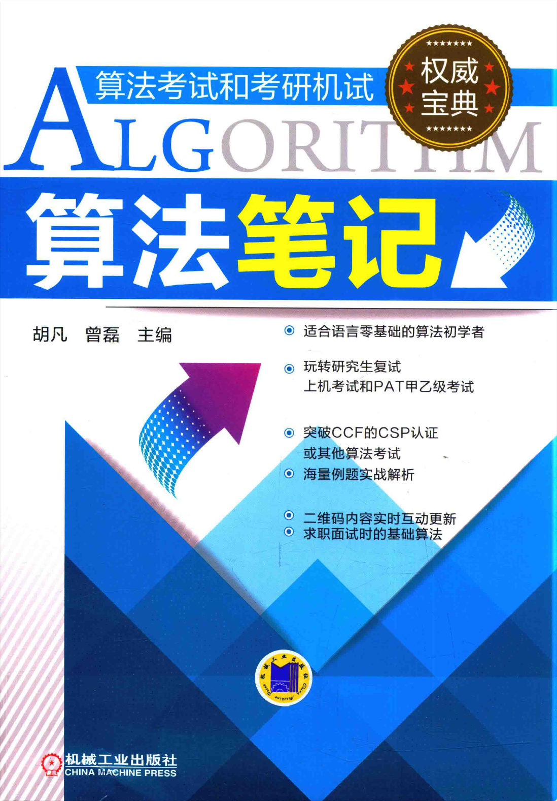

# README

算法笔记——机械工业出版社

电子书PDF链接：链接: https://pan.baidu.com/s/1QlU2EL2T7d7Ust_VTAj1_g?pwd=jky9 提取码: jky9 

文件夹里会有细化的题单、题目、解析

书中没有的但我觉得的好题也会丢进去。

但笔者在写笔记时，舍弃了过于基础的一些部分，还请见谅

---

本书语法讲的很详尽，且避免了过于深奥底层的理论部分，恰如其分。

且语法是C语言（C++也可以用，因为C++向下兼容了C）

算法覆盖面全

推荐：⭐⭐⭐⭐⭐

